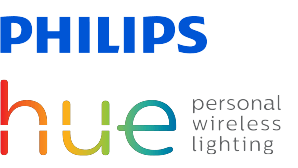
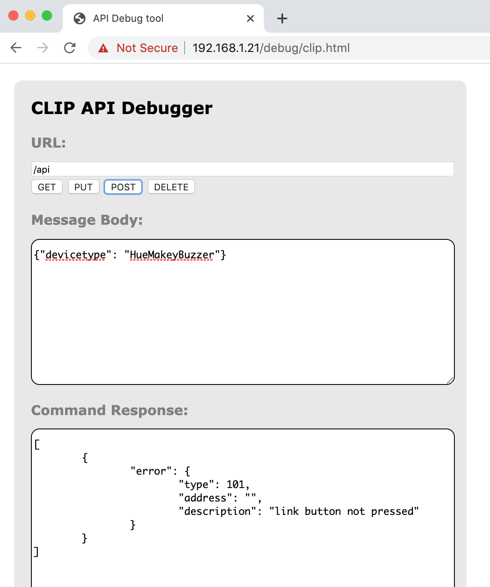
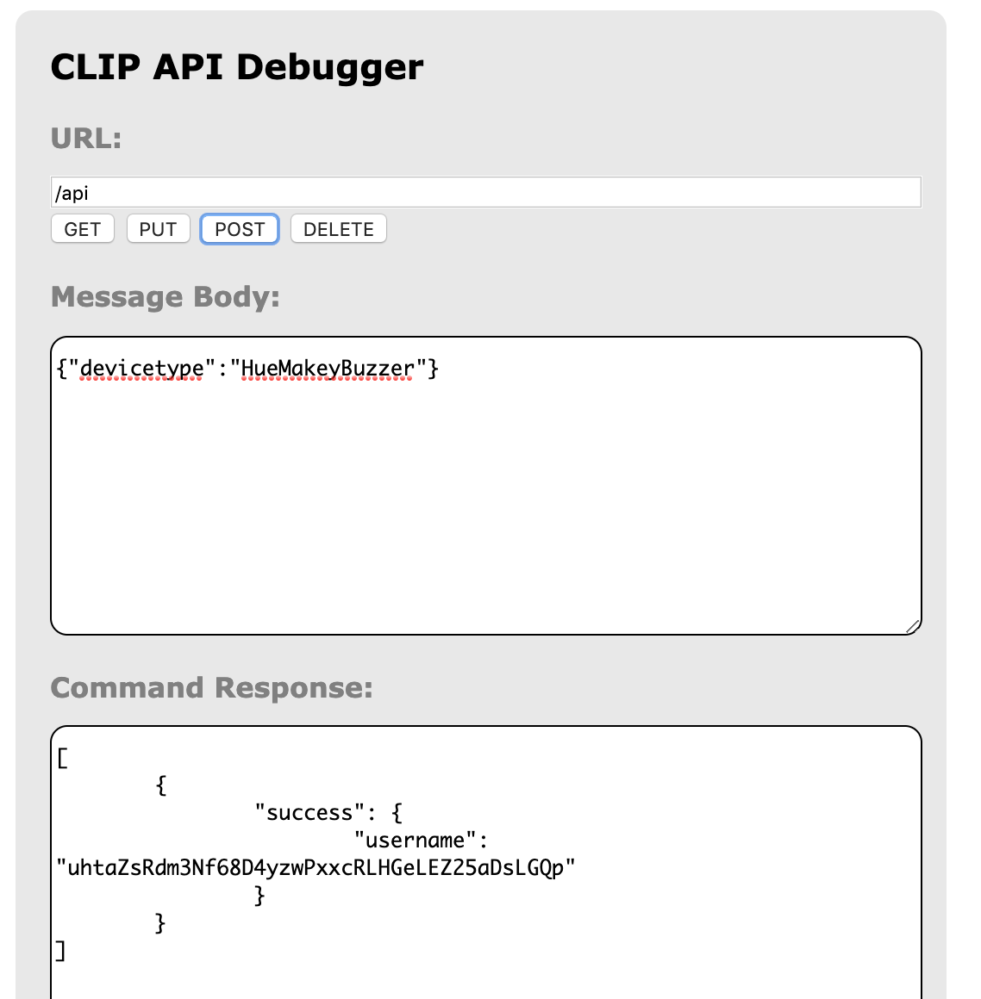
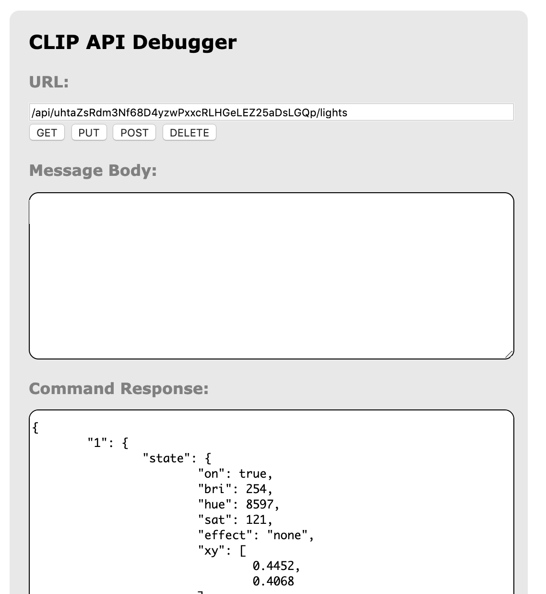

# HueMakeyBuzzer

[](https://www2.meethue.com/)

[](https://makeymakey.com/)

HueMakeyBuzzer is a Node.js application connecting your [Makey Makey](https://makeymakey.com/) to your [Philips Hue](https://www2.meethue.com/) (via your computer) to be used as quiz 'buzzer'. Players/Teams are configured with uniue colours and one their button press the Hue light willchange to their colour and all other inputs will be ignored until the reset timer has expired.

## Requirements

  - Philips Hue bridge and colour lamp
  - Makey Makey board
  - Computer running Node.js v12 or higher

## Setup
#### Philips Hue
Find the IP address of your Philips Hue bridge. I did this by logging on to my router admin console and viewing `Attached Devices`.


(Hint: If you want to avoid potentitally having to find the IP address again, your router may allow you to configure a static IP based on the Hue bridge MAC address).

In a browser, navigate to `http://<ip address of bridge>/debug/clip.html` This is a handy API tool hosted by the bridge itself that allows you to try out API commands.

The first thing you must do is register a user to make requests as. Do this by submitting the following JSON object as a POST request to the URL: `/api`

Press the 'Link' button on the Hue bridge first, otherwise the POST request will return an error.

```JSON
{"devicetype": "HueMakeyBuzzer"}
```

Error response:



Success response:



Copy the long string returned as the value of the 'username' property, we need this to configure the application to talk to the bridge. Right now though we need to request a list of all the lights the bridge knows about, to find the one to use for the buzzer.

Using the tool make a GET request to `/api/<newly generated user id>/lights`



Find the target light for the buzzer and make a note of the ID (the key to the map, in this example we are using lamp "1").

#### Application

HueMakeyBuzzer operation is configured by editing the `config.json` file in the project root. Here is how the file breaks down and what you need to configure.

**hue**

```JSON
    "hue": {
        "bridgeIP": "192.168.1.21",
        "user": "uhtaZsRdm3Nf68D4yzwPxxcRLHGeLEZ25aDsLGQp",
        "lightId": 1
    },
```

Configure the IP address of the Hue bridge (the one we've been using to access the API tool), the newly generated user ID, and the ID of the lamp we want to control.

**players**

```JSON
    "players": [
        {
            "name": "Team 1",
            "buzzerKey": "UP",
            "colour": "Red"
        },
        {
            "name": "Team 2",
            "buzzerKey": "DOWN",
            "colour": "Blue"
        }
    ],
```

Create as many entries in the player array as needed. Each player should have the following properties.

* **name**: free text, the name of the team or player.
* **buzzerKey**: the keycode from the Makey Makey (we are using the direction arrows in this example).
* **colour**: the key from the map of colour names to Hue values from the next config section.

**colours**

```JSON
    "colours": {
        "Red": 0,
        "Green": 25500,
        "Blue": 45580,
        "Neutral": 8597
    },
```

This section is a map of colour names (the names themselves do not matter) to Hue values. These key values must match with the colour property from the player config.

**general**

```JSON
    "resetColour": "Neutral",
    "resetSeconds": 5
```

The resetColour property is the colour the light will be set to once a successful buzz-in has been signalled. Once the number of seconds represented by the resetSeconds property has expired, the light will be set to this colour and the application will accept new buzzes.

## Operation

Start the application by running the following command from a terminal session:

`npm start`

The application will output the following:

`Press any key (Ctrl+C to quit)...`

The application will now listen for keypresses (via the keyboard or Makey Makey) and if a keypress corresponds to a configured buzzerKey (and no-one else has buzzed already) the Hue light will change to the configured colour and further inputs will be ignored until the resetSeconds timer has expired.

